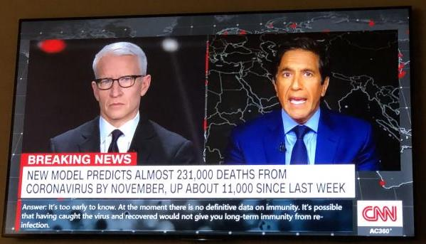
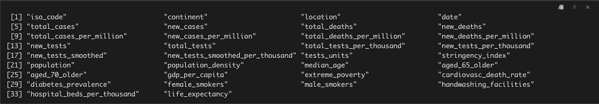
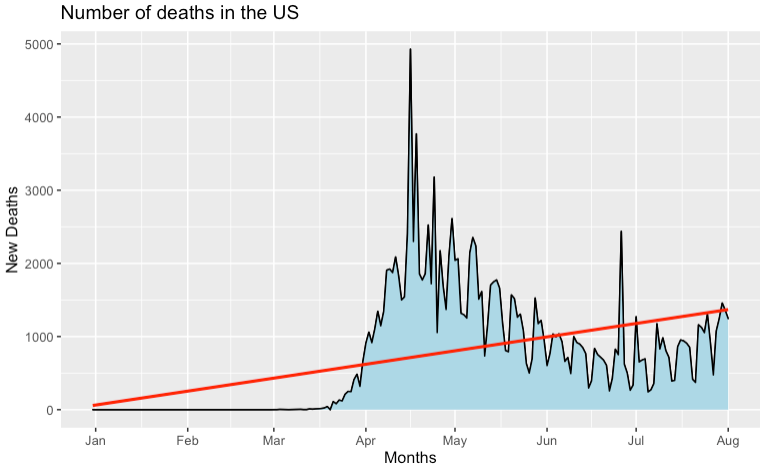
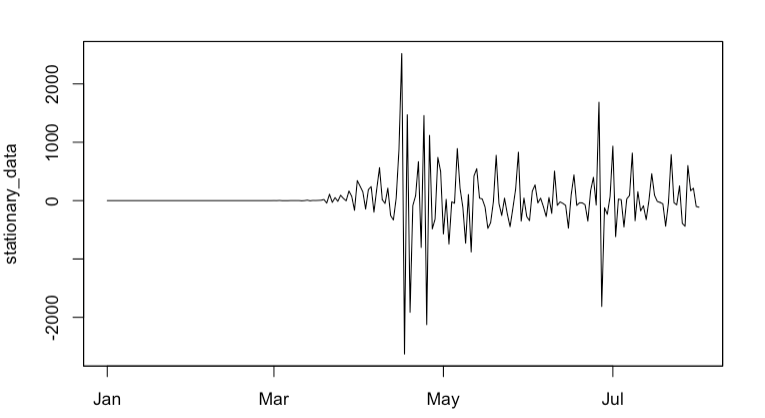
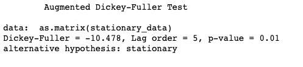
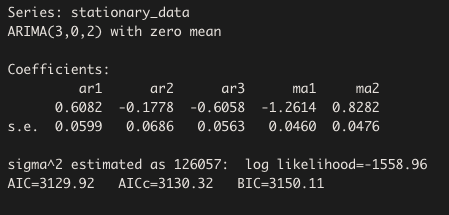
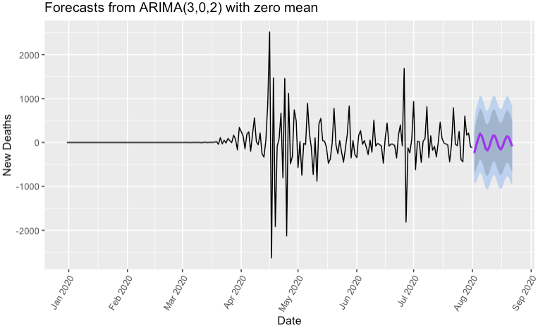
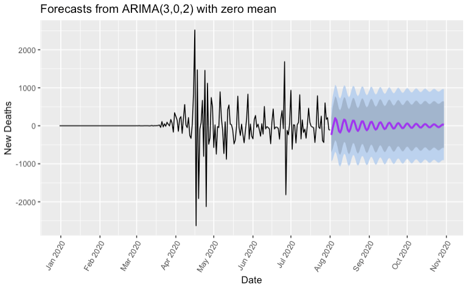

<!-- Add buttons here -->

# Predicting number of Covid19 deaths using Time Series Analysis (ARIMA MODEL) 
**Project Status: Completed**
 
<a href="https://nbviewer.jupyter.org/github/navido89/Time-Series-Analysis-ARIMA-Model-Covid19-Predictions/blob/master/Predicting%20number%20of%20Covid19%20deaths%20using%20Time%20Series%20Analysis%20%28ARIMA%20MODEL%29%C2%B6.ipynb" target="_blank">Jupyter Notebook Viewer</a>
 
<a href="https://towardsdatascience.com/predicting-number-of-covid19-deaths-using-time-series-analysis-arima-model-4ad92c48b3ae" target="_blank">Read Article</a>

## Table of contents
- [Project Objective](#project-objective)
- [Methods Used](#methods-used)
- [Technologies](#technologies)
- [Project Description](#project-description)
- [Project Results](#project-results)
- [Installation](#installation)

## Project Objective
[(Back to top)](#table-of-contents)
 
The purpose of this project is to get a deeper understanding of Time Series Analysis so we can solve the following problem: 
+ How many people are going to die due to Covid19 in the United States from August 1st — August 21st and August 1st — November 1st.

We compare our results with the projections that have been made by CNN.
 

## Methods Used
[(Back to top)](#table-of-contents)
+ Time Series Analysis 
+ Arima Model
+ Data Visualization
+ Data Cleaning 

## Technologies:
[(Back to top)](#table-of-contents)
+ R
+ ggplot2
+ tidyverse
+ zoo
+ aTSA
+ ggplot2tseries
+ forecast
+ lubridate

## Project Description:
[(Back to top)](#table-of-contents)
+ Data Source: Used the data set from "Our World in Data", which consisted of 34033 rows and 34 columns. See features below: 

+ Feature engineered the date column and transformed the class from a factor to date. 
+ In regard to data cleaning, I selected the US data points. 

+ Implemented the differencing technique to make our data stationary in order to conduct a time series analysis. See transformation below. From non-stationary to stationary.

+ In order to check if our data is now stationary, we conducted the Augmented Dickey-Fuller Test, which tells us if our data is stationary or not.
  + H_0: The null hypothesis is that there is a unit root.
  + H_A: The alternative hypothesis is that the time series is stationary.
  + The p-value of our test was 0.01 on a significance level of 0.05. Hence, we rejected the null hypothesis. In other words, our data is now stationary and we can   proceed with the analysis.

+ Used the ARIMA model and its auto.arima function to conduct our projection.

## Project Results:
[(Back to top)](#table-of-contents)
+ Final model projected 18589 deaths and CNN projected 19000 deaths between August 1st and August 21st.

+ Between August 1st and November 1st my model projected 235967 deaths and CNN projected 231000 deaths. Actual death number according to Worldometer was 236072.

## Installation:
[(Back to top)](#table-of-contents)
+ Clone this repo <a href="https://docs.github.com/en/free-pro-team@latest/github/creating-cloning-and-archiving-repositories/cloning-a-repository" target="_blank">(for help see this tutorial).</a>
+ Raw Data is being kept in this repo. <a href="https://github.com/navido89/Time-Series-Analysis-ARIMA-Model-Covid19-Predictions/blob/master/owid-covid-data.csv" target="_blank">Click here for raw data.</a>
+ Data processing/transformation script is being kept in this repo. <a href="https://github.com/navido89/Time-Series-Analysis-ARIMA-Model-Covid19-Predictions/blob/master/Predicting%20number%20of%20Covid19%20deaths%20using%20Time%20Series%20Analysis%20(ARIMA%20MODEL)%C2%B6.ipynb" target="_blank">Click here for notebook.</a>

