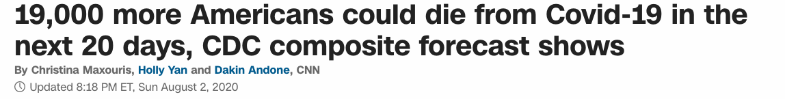

# Predicting number of Covid19 deaths using Time Series Analysis (ARIMA MODEL) 
**Project Status: Completed**
 
<a href="https://nbviewer.jupyter.org/github/navido89/Time-Series-Analysis-ARIMA-Model-Covid19-Predictions/blob/master/Predicting%20number%20of%20Covid19%20deaths%20using%20Time%20Series%20Analysis%20%28ARIMA%20MODEL%29%C2%B6.ipynb" target="_blank">Jupyter Notebook Viewer</a>
 
<a href="https://towardsdatascience.com/predicting-number-of-covid19-deaths-using-time-series-analysis-arima-model-4ad92c48b3ae" target="_blank">Read Article</a>

## Project Objective : 
The purpose of this project is to get a deeper understanding of Time Series Analaysis so we can solve the following problem: 
+ How many people are going to die due to Covid19 in the United States from August 1st — August 21st and August 1st — November 1st.

We compare our results with the projections that have been made by CNN.
 

## Methods Used
+ Time Series Analysis 
+ Arima Model
+ Data Visualization
+ Data Cleaning 

## Technologies:
+ R
+ ggplot2
+ tidyverse
+ zoo
+ aTSA
+ ggplot2tseries
+ forecast
+ lubridate

## Project Description:
+ Data Source: Used the data set from "Our World in Data", which consisted of 34033 rows and 34 columns. 
+ Feature engineered the date column and transformed the class from a factor to date. 
+ In regards to data cleaning, I selected the US data points. 
+ Implemented the differencing technique to make our data stationary in order to conduct a time series analysis. 
+ Applied the Augmented Dickey-Fuller Test to make sure our data is stationary. 
+ Used the ARIMA model and its auto.arima function to conduct our projection.

## Project Results:
+ Final model projected 18589 deaths and CNN projected 19000 deaths between August 1st and August 21st.

+ Between August 1st and November 1st my model projected 235967 deaths and CNN projected 231000 deaths. Actual death number according to Worldometer was 236072.

## Getting Started:
+ Clone this repo <a href="https://docs.github.com/en/free-pro-team@latest/github/creating-cloning-and-archiving-repositories/cloning-a-repository" target="_blank">for help see this tutorial</a>.
+ Raw Data is being kept in this repo. File name is "owid-covid-data.csv".
+ Data processing/transformation script is being kept in this repo. Notebook file name is "Predicting number of Covid19 deaths using Time Series Analysis (ARIMA MODEL)¶.ipynb"

